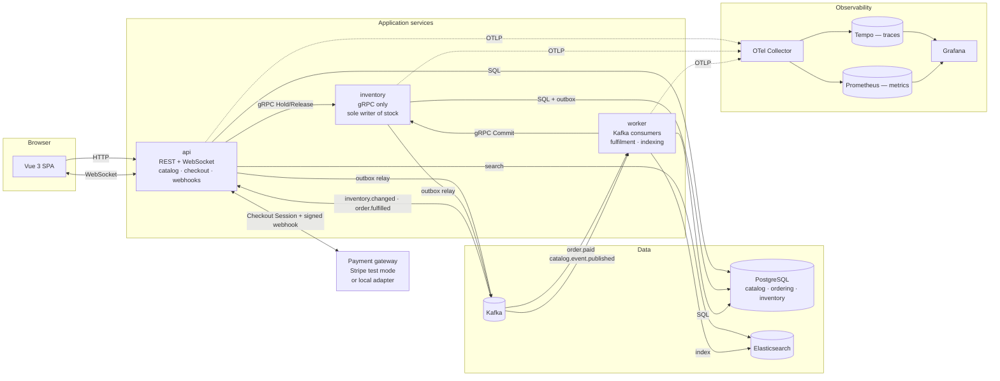

# Berlin Tickets — an event ticketing platform

A small ticketing domain — venues host events, events sell ticket types with finite
inventory, customers buy through a checkout — built to demonstrate seven things properly
rather than twenty things partially: **observability, payments, event-driven processing,
search, realtime, gRPC and testing**.

NestJS + TypeScript on the backend, Vue 3 + TypeScript on the front, PostgreSQL, Kafka,
Elasticsearch, and OpenTelemetry throughout. One `docker compose up` starts all of it.

## Architecture



Three application services, and each one exists because it demonstrates something.
`inventory` is a separate process because it is the gRPC boundary. `worker` is a separate
process because it is where the asynchronous half of a checkout happens, and because a
trace that crosses a process boundary is the whole point. Everything else — catalog,
search, orders, payments, the WebSocket gateway — lives in `api` as separate NestJS
modules with no cross-module data access. Splitting those into their own containers would
have added three more services to explain and made the trace *harder* to read, not easier.

## See a distributed trace

Three commands. The third prints a Grafana link to a single trace covering an entire
purchase — HTTP handler → PostgreSQL → gRPC → payment webhook → Kafka → consumer in
another process → gRPC → PostgreSQL.

```bash
docker compose up -d --build
```

```bash
curl -fsS --retry 60 --retry-all-errors --retry-delay 5 http://localhost:3000/health/ready
```

```bash
npm run demo:checkout
```

The last command buys two tickets, completes the payment, waits for the asynchronous
fulfilment, and prints:

```
  Distributed trace (HTTP -> gRPC -> Kafka -> consumer):
  http://localhost:3001/explore?panes=...traceql...

  Dashboard:      http://localhost:3001/d/ticketing-red/ticketing-red-metrics
  Confirmation:   http://localhost:5173/orders/<id>?token=<token>
  Email:          http://localhost:8025
```

Open the trace link. The span list runs from `POST /checkout` in `api`, through
`inventory.hold` in `inventory`, on through `order.paid process` in `worker`, and ends at
the `INSERT INTO ordering.ticket` that issued the tickets. Three services, one trace, no
manual correlation.

Grafana needs no login: anonymous access is enabled, and the datasources and the dashboard
are both provisioned from `infra/grafana/`.

### Where everything lives

| Service | URL | Notes |
| --- | --- | --- |
| Web app | http://localhost:5173 | Vue 3 SPA |
| API | http://localhost:3000 | REST + Socket.IO |
| Grafana | http://localhost:3001 | Dashboards and trace explorer, no login |
| Prometheus | http://localhost:9090 | |
| Tempo | http://localhost:3200 | Queried through Grafana |
| Mailpit | http://localhost:8025 | Confirmation emails land here |
| Elasticsearch | http://localhost:9200 | |
| PostgreSQL | localhost:5432 | `app` / `app`, database `ticketing` |
| inventory (gRPC) | *not published* | Internal network only, deliberately |

Seed data loads automatically: nine events across real Berlin venues — Berghain, Astra
Kulturhaus, Columbiahalle, Festsaal Kreuzberg, Silent Green, Hamburger Bahnhof — plus one
in Hamburg so the city filter has something to exclude. The app is never empty on first
run.

## Payments without a Stripe account

The seven requirements ask for Stripe test mode; the constraints ask for one command and
no extra README steps. Both are satisfied by putting a `PaymentGateway` interface between
the application and the provider:

- **`STRIPE_SECRET_KEY` and `STRIPE_WEBHOOK_SECRET` set** → real Stripe Checkout Sessions,
  real webhooks, `stripe listen` forwarding to `http://localhost:3000/webhooks/payments`.
  Test cards `4242 4242 4242 4242` (success) and `4000 0000 0000 0002` (decline).
- **Neither set** → a local adapter that produces a checkout page, then posts a webhook to
  the same endpoint signed with the *same* HMAC scheme Stripe uses
  (`t=<unix>,v1=<hmac-sha256 of "timestamp.body">`, five-minute tolerance).

Signature verification, webhook deduplication, the order state machine, Kafka publication
and fulfilment are the same code on both paths. The local adapter replaces the provider,
not the risky parts. That means the payment path is genuinely exercised on every clone of
this repository, not only on machines with API keys.

To use real Stripe:

```bash
cp .env.example .env   # fill in the two Stripe values
docker compose up -d --build
stripe listen --forward-to localhost:3000/webhooks/payments
```

## The awkward payment paths, handled explicitly

**The webhook arrives before the browser redirect.** This is not handled — it is designed
away. Fulfilment is driven *only* by the webhook; the redirect never mutates state. So by
the time the customer's browser reaches the confirmation page, one of two things is true:
the order is already fulfilled and the page renders tickets immediately, or it is still
pending and the transition arrives over the WebSocket a moment later. Neither ordering is
special-cased, because neither is exceptional. See `apps/web/src/views/OrderView.vue`.

**A replayed webhook.** The provider event id is the primary key of
`ordering.webhook_event`. The second delivery inserts nothing and does nothing, and still
returns 200 — answering a replay with an error is how you get retried for a week.

**A declined card.** `payment.failed` moves the order to `failed` and releases the hold
over gRPC. That release is deliberately best-effort: if inventory is unreachable, the
reservation's TTL and the inventory service's sweeper collect it anyway. Making it
mandatory would turn a declined card into a 500 that the provider then retries for days.

**An expired session.** `checkout.session.expired` moves the order to `expired` and
releases the seats. The payment session lifetime and the inventory hold TTL are both 15
minutes and both derive from `HOLD_TTL_MS`, so they cannot drift apart.

## How exactly-once fulfilment is guaranteed

The requirement was that the consumer survive being killed mid-batch without losing or
double-processing an order. Here is the mechanism, precisely.

**Producing.** When the webhook marks an order paid, one PostgreSQL transaction does two
things: updates `ordering.customer_order.status`, and inserts a row into
`ordering.outbox`. Both or neither. There is no window in which money was taken and no
fulfilment message exists, and none in which a message exists for a transaction that
rolled back. A relay polls the outbox with `FOR UPDATE SKIP LOCKED` — so it scales past
one replica unchanged — and publishes to Kafka.

**Consuming.** `startConsumer` runs with `autoCommit: false`. Per message:

1. `inventory.Commit(orderId)` over gRPC. Idempotent: a reservation already `committed`
   returns the same numbers and reports `changed: false`.
2. One PostgreSQL transaction — insert `(consumer_group, message_id)` into
   `ordering.processed_message`. If that returns zero rows this is a replay, so do nothing
   and commit. Otherwise insert the tickets, mark the order fulfilled, and enqueue
   `order.fulfilled`.
3. **Only then** commit the Kafka offset.

Step 1 must precede step 2, and that is the subtle part. If the inbox claim came first, a
crash between the two would leave a message marked processed whose inventory was never
committed, and the redelivery would skip it forever. Committing inventory first is safe
precisely because that call is idempotent.

Kill the process at any point and the offset has not advanced, so Kafka redelivers. The
redelivery either repeats a no-op gRPC call and then finds the inbox row present, or finds
nothing done and does all of it. **No ordering of a crash issues a ticket twice or drops
one.**

This is at-least-once delivery with an idempotent handler. It is not exactly-once
delivery, and the code does not claim to be — a Kafka transaction cannot span PostgreSQL,
so anyone claiming otherwise is describing something they have not built.

Three separate guards exist because three different replays are possible, and conflating
them is the classic way to ship something that looks idempotent and is not:

| Replay | Guard | Where |
| --- | --- | --- |
| Browser double-submits checkout | `customer_order.idempotency_key` (unique) | `orders.service.ts` |
| Provider replays a webhook | `webhook_event.provider_event_id` (primary key) | `payments.service.ts` |
| Kafka redelivers after a crash | `processed_message` (composite primary key) | `platform/inbox.ts` |

Under all three sits the backstop: `ordering.ticket` is unique on
`(order_id, ticket_type_id, seq)`, and serials are derived deterministically from those
same three values. With every guard above removed, the second insert still collides.

Check it yourself after running the demo — zero rows means no order was ever committed
twice:

```bash
docker compose exec postgres psql -U app -d ticketing -c "SELECT ref_id, count(*) FROM inventory.ledger WHERE reason = 'commit' GROUP BY ref_id HAVING count(*) > 1;"
```

### Try killing the consumer

```bash
docker compose stop worker && npm run demo:checkout && docker compose start worker
```

The order sits at `paid` while the worker is down and reaches `fulfilled` seconds after it
returns. Nothing is lost, and Grafana's "Outbox backlog" panel shows the queue building
and draining.

## Search: the indexing path

Event creation **never** writes to Elasticsearch. Publishing an event writes a row to the
outbox in the same transaction that flips its status, and returns. The worker's indexer
consumer picks that row up and indexes it. Which means:

- **Elasticsearch down when an event is created** — the event is created anyway, the
  message waits in Kafka, and it is indexed when Elasticsearch returns. Nobody loses an
  event because search was restarting.
- **Indexing fails repeatedly** — after five attempts the message goes to
  `search.index.dlq` with the error in its headers and the offset advances, so one
  poisoned document cannot block every event behind it.
- **Elasticsearch down while browsing** — `SearchService` falls back to an ILIKE query
  against PostgreSQL and marks the response `source: "database"`, which the UI displays as
  a badge. A degraded result is never silently mistaken for an empty one.
- **The index is lost entirely** — `reindexAll()` rebuilds it from PostgreSQL, which
  remains the source of truth. Elasticsearch is a read model, never a system of record.

The cost is that a new event becomes searchable a second or two after creation rather than
instantly. For a ticketing catalogue that is not a cost.

The mapping lives in `packages/contracts/src/search.ts`, shared by its only writer (the
worker) and its only reader (the API), so the two cannot disagree about a field type.
Full-text runs over title, venue name and description with `asciifolding` — Berlin
listings mix German and English, and a search for "buhne" has to match "Bühne".

## Why gRPC here and REST there

The inventory service speaks gRPC. The public API speaks REST/JSON. That is not
inconsistency; they are two different problems.

**Why gRPC for inventory.** Every call is internal, between two of our own services, and
issued on every page view and every checkout. The `.proto` is a schema both sides compile
against, so renaming a field breaks the build instead of producing a 400 discovered in
production. Binary framing over HTTP/2 on a persistent connection matters when
`GetAvailability` runs on every event page load. And the calls are command-shaped —
`Hold`, `Commit`, `Release` — which maps to an RPC far more honestly than to a REST verb:
`POST /inventory/holds` is a procedure call wearing a costume.

**Why not gRPC for the public API.** Its clients are browsers, which cannot speak gRPC
without a proxy layer that adds a container and a translation step for no gain. Its
consumers are people who need to read a URL, curl an endpoint, and paste a response into a
bug report. REST/JSON is cacheable by anything in the path, debuggable with tools everyone
already has, and versionable without regenerating a client. gRPC would trade all of that
for type safety the browser cannot enforce anyway.

The generated types are committed (`packages/contracts/src/generated/`) so a reviewer can
read the wire contract without installing `protoc`, and CI fails if the `.proto` changes
without them being regenerated.

## Realtime

Open the same event page in two browsers and buy in a third — both counters drop at the
same moment, with neither page reloading or polling.

The inventory service writes `inventory.changed` to its own outbox inside the transaction
that changed the number. The relay publishes to Kafka. Every API instance consumes that
topic **with a consumer group unique to the process** (hostname + pid) and pushes to the
Socket.IO room for that event.

That unique group is the interesting decision. Normally you want partitions shared across
a consumer group so each message is handled once. Here the opposite is required: every API
instance holds a different set of WebSocket connections and can only push to its own, so
each instance must see every message. Sharing partitions would mean a browser connected to
instance A never hears about a message instance B consumed. The consequence is that these
groups are disposable and their offsets meaningless, which is why the consumer starts from
the latest offset — replaying an hour of inventory history at a browser that just
connected would be noise.

## Data model

One PostgreSQL instance, three schemas, three roles. Each service connects as its own role
and is granted rights only on the schema it owns, so a cross-boundary read fails at the
database instead of relying on code review to catch it (`infra/postgres/init.sql`). A
production deployment would use three separate databases; the failure mode is identical
and this keeps `docker compose up` to one PostgreSQL container.

**`catalog`** — written by `api`.
`venue`, `event`, `ticket_type`. Money is always an integer count of minor units; there is
no `NUMERIC` and no float in the schema. The service fee is stored in basis points so
pricing stays integer arithmetic with one named, tested rounding rule.

**`inventory`** — written only by `inventory`.
`ticket_type_inventory` holds three counters — total, reserved, sold — with
`CHECK (quantity_reserved + quantity_sold <= quantity_total)`. Overselling is a database
error, not a race the application hopes to win. `available` is derived, never stored, so
it cannot drift. `reservation` models the hold that keeps seats off the market during the
redirect to payment; `ledger` is append-only and makes "prove you did not
double-decrement" a SQL query rather than an argument.

**`ordering`** — written by `api` and `worker`.
`customer`, `customer_order`, `order_item`, `ticket`, plus the three idempotency guards
(`webhook_event`, `processed_message`) and the outbox. Order item names and prices are
snapshotted so an order still renders correctly after the catalogue changes underneath it.

### Notable modelling decisions

**Holds rather than decrement-on-purchase.** Between "pressed buy" and "webhook confirms"
there are seconds to minutes during which those seats must not be sellable to anyone else
but must come back if the customer closes the tab. A hold with a TTL is the only honest
model of that. The cost is a sweeper job in the inventory service, which is a price worth
paying to make overselling impossible.

**`paid` and `fulfilled` are separate states.** Money is captured by the webhook; tickets
are issued by the Kafka consumer. The gap between them is exactly where a crash can
happen. Collapsing them into one state would make that window invisible.

**The order table is `customer_order`.** `ORDER` is reserved, and quoting it in every
query is a papercut with no upside.

**No authentication.** Guest checkout by email; the confirmation page is reachable with an
unguessable `access_token`. Adding auth would have spent a reviewer's attention on
something that demonstrates none of the seven things this project is for. It is a scope
decision, not an oversight.

**The API's outbox lives in the `ordering` schema** and carries catalog events too. One
service, one outbox, one relay. Giving `catalog` its own outbox table would mean a second
relay polling a second table for no behavioural difference.

## Observability, in more detail

Instrumentation is loaded through `node --require` (see the `Dockerfile`) so the SDK
patches `http`, `pg`, `grpc` and `kafkajs` before the application imports them. Calling
`sdk.start()` from inside `main.ts` is the single most common reason a service produces a
trace with one span in it and nothing underneath.

**Trace continuity across Kafka** is the piece that makes this more than a tutorial, and
it took three separate mechanisms to get right. Each one is a place where the trace
silently breaks if you leave it out:

1. **The checkout's context is stored on the order** (`customer_order.trace_context`). A
   payment webhook is an independent inbound HTTP request that arrives minutes later, so
   it starts its own trace. Without this, one purchase is split across two traces: the
   customer's checkout in one, the payment and everything downstream in another. The
   webhook handler resumes the stored context, and keeps a `checkout.trace_id` attribute
   on its own span so the link is navigable from both ends.
2. **The outbox row captures the active context inside the transaction**, so the message
   about a state change cannot end up in a different trace from the change itself.
3. **The relay publishes each row under that stored context.** This one is the least
   obvious and the easiest to get wrong. The relay polls on a timer, so it has no active
   span, and kafkajs's auto-instrumentation will happily open a brand new root trace for
   its producer span — then inject *that* trace id into the message headers, overwriting
   anything set by hand. The consumer joins it faithfully, the worker traces perfectly,
   and the end-to-end trace stops dead at the Kafka boundary while every individual
   service looks correctly instrumented. Restoring the stored context around the publish
   makes the producer span a child of the checkout instead.

The result is one trace of roughly 70 spans covering `POST /checkout` → PostgreSQL → gRPC
hold → WebSocket broadcast → payment webhook → Kafka → fulfilment in another process →
gRPC commit → ticket insert → confirmation email → Kafka → WebSocket. An end-to-end test
asserts all three service names appear in it, so this cannot regress unnoticed.

See `packages/otel/src/tracing.ts`, `packages/platform/src/relay.ts` and
`apps/api/src/payments/payments.service.ts`.

**RED metrics** come from one histogram, `http.server.request.duration`: rate is its
count, errors are the subset with an error status attribute, duration is the distribution.
One instrument, three panels, no double counting. The route label is always the route
template (`/events/:slug`), never the raw path — labelling by raw path mints a new time
series per event id and takes Prometheus down long before the application struggles. An
end-to-end test asserts this, by failing if any route label contains something UUID-shaped.

Beyond RED: gRPC client latency, Kafka messages consumed by topic and outcome,
idempotency suppressions by guard, search index failures, live WebSocket connections, and
**outbox backlog** — the one gauge worth waking someone up for, because a rising backlog
means orders are paid for and not being fulfilled.

The dashboard is committed as JSON at
`infra/grafana/dashboards/ticketing-red.json` and provisioned automatically, along with
both datasources. Nothing is clicked into existence.

## Testing

**Unit tests (Vitest)** cover the domain rules and nothing else. Everything in
`packages/domain` is pure — no database, no network, no clock it does not receive as an
argument — which is why these tests are fast and test behaviour rather than mocks.

```bash
npm test
```

They cover: pricing (fee rounding half-up, fractional cents, free orders taking no fee,
per-order and per-ticket-type limits, the same ticket type split across two lines to dodge
a limit, sales windows at both boundaries), inventory (reserving the last seat, refusing
to oversell by one, commit and release being idempotent, TTL expiry at the exact
boundary), idempotency (fingerprints stable across line reordering and email casing,
dedupe keys scoped per consumer group, deterministic ticket serials) and the order state
machine (replays as no-ops, illegal transitions rejected, terminal states final).

**End-to-end tests (Playwright)** run against the real stack — real Kafka, real
Elasticsearch, real signed webhooks. Nothing is mocked, because the parts most worth
testing here are exactly the parts a mock would replace.

```bash
docker compose up -d --build
npm run e2e
```

They cover browse → search → checkout → confirmation, a declined card releasing its
seats, a replayed webhook not issuing a second set of tickets, a retried checkout
returning the same order, an unsigned webhook being rejected, two browsers watching one
counter drop together, and — the one that matters most — that a single trace id reaches
Tempo carrying spans from `api`, `inventory` **and** `worker`. If the trace ever stops at
the Kafka boundary, that test fails.

**CI** (`.github/workflows/ci.yml`) runs lint, typecheck, build and unit tests on one job,
and on another runs `docker compose up -d --build` — the exact command in this README — and
the full end-to-end suite against it. If the README's promise of one command ever breaks,
CI breaks with it.

## Repository layout

```
apps/
  api/          NestJS — catalog, search, checkout, payment webhooks, WebSocket gateway
  inventory/    NestJS — gRPC only, sole writer of stock, hold/commit/release + TTL sweeper
  worker/       NestJS — Kafka consumers: fulfilment and search indexing
  web/          Vue 3 + Vite SPA
packages/
  domain/       Pure business rules. Zero I/O. What the unit tests exercise.
  contracts/    The .proto, generated gRPC types, Kafka event schemas, ES mapping
  platform/     Shared infrastructure: pg pool, transactions, outbox, relay, inbox, Kafka
  otel/         Telemetry bootstrap, tracing helpers, RED metric instruments
db/             SQL migrations and a 90-line migration runner
infra/          Collector, Prometheus, Tempo, Grafana provisioning, PostgreSQL roles
e2e/            Playwright suite
scripts/        seed.mjs (Berlin venues), demo-checkout.mjs (the trace demo)
```

## Local development without Docker

The infrastructure still comes from Compose; only the application services move to the
host.

```bash
docker compose up -d postgres kafka elasticsearch otel-collector tempo prometheus grafana mailpit
npm install
npm run build
node db/migrate.mjs
node --require ./packages/otel/dist/register.js apps/inventory/dist/main.js   # terminal 1
node --require ./packages/otel/dist/register.js apps/api/dist/main.js         # terminal 2
node --require ./packages/otel/dist/register.js apps/worker/dist/main.js      # terminal 3
npm run dev --workspace=@ticketing/web                                        # terminal 4
```

Set `DATABASE_URL`, `KAFKA_BROKERS=localhost:29092`, `ELASTICSEARCH_URL` and
`INVENTORY_GRPC_URL=localhost:50051` to point at the containers.

## Trade-offs I would revisit with more time

- **One PostgreSQL instance, three schemas.** Enforced by grants, but still one instance.
  Three databases would be the honest production shape.
- **JSON on Kafka with zod validation, no schema registry.** A registry is another
  container and another failure mode during `docker compose up`, and it would not
  demonstrate anything on the list. With more than one team writing producers, it becomes
  necessary.
- **Polling the outbox rather than logical replication.** One file instead of a Debezium
  container, at the cost of a few hundred milliseconds of latency. The properties that
  matter come from the outbox table, not from how it is read.
- **Twelve containers, roughly 4 GB.** That is the real cost of demonstrating seven things
  at once. Elasticsearch is capped at a 512 MB heap to keep it laptop-sized. Putting it
  behind a Compose profile would lighten the stack but break the one-command promise, so
  it stays on.
- **No admin portal, no seat maps, no refunds, no auth.** Each was cut deliberately.
  Feature count was never the goal.

## Licence

MIT.
