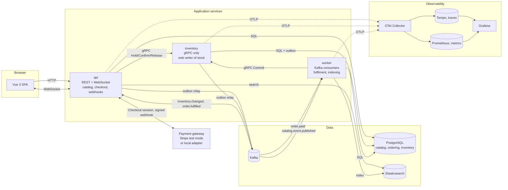

# Berlin Tickets

[](https://github.com/Y-sebaei/event-ticketing-platform/actions/workflows/ci.yml)

An event ticketing platform. Venues host events, events sell ticket types with finite
inventory, and customers buy through a checkout. That is the whole domain, kept small on
purpose so the interesting parts could be built properly instead of half a dozen features
being sketched out.

There are seven of those interesting parts: observability, payments, event-driven
processing, search, realtime updates, gRPC, and testing. NestJS and TypeScript on the
back, Vue 3 on the front, Postgres, Kafka, Elasticsearch, and OpenTelemetry throughout.

One `docker compose up` starts all of it.

## Architecture



Three backend services, and each one earns its own process. `inventory` is separate
because it is the gRPC boundary. `worker` is separate because it is where the asynchronous
half of a checkout happens, and a trace that survives a process hop is most of what this
project is trying to show.

Everything else lives in `api` as NestJS modules that do not touch each other's
repositories. Catalog, search, orders, payments, and the WebSocket gateway could each have
been their own container. I did not split them because it would have added three more
services to explain and made the trace harder to read rather than easier. A reviewer
looking for microservice orthodoxy will notice. I would rather argue for the decision than
pad the container count.

## See a distributed trace

Three commands. The last one prints a Grafana link to a single trace covering an entire
purchase: HTTP handler, Postgres, gRPC, payment webhook, Kafka, a consumer in a different
process, gRPC again, Postgres again.

```bash
docker compose up -d --build
```

```bash
curl -fsS --retry 60 --retry-all-errors --retry-delay 5 http://localhost:3000/health/ready
```

```bash
npm run demo:checkout
```

The last command buys two tickets, pays for them, waits for the asynchronous fulfilment,
and prints something like:

```
  Distributed trace (HTTP -> gRPC -> Kafka -> consumer):
  http://localhost:3001/explore?panes=...traceql...

  Dashboard:      http://localhost:3001/d/ticketing-red/ticketing-red-metrics
  Confirmation:   http://localhost:5173/orders/<id>?token=<token>
  Email:          http://localhost:8025
```

Open the trace link. It runs from `POST /checkout` in `api`, through `inventory.hold` in
`inventory`, on through `order.paid process` in `worker`, and ends at the insert that
issued the tickets. Around 70 spans, three services, one trace id, no manual correlation.

Grafana needs no login. Anonymous access is on, and the datasources and dashboard are
provisioned from `infra/grafana/`.

### Where everything lives

| Service | URL | Notes |
| --- | --- | --- |
| Web app | http://localhost:5173 | Vue 3 SPA |
| API | http://localhost:3000 | REST and Socket.IO |
| Grafana | http://localhost:3001 | Dashboards and trace explorer, no login |
| Prometheus | http://localhost:9090 | |
| Tempo | http://localhost:3200 | Queried through Grafana |
| Mailpit | http://localhost:8025 | Confirmation emails arrive here |
| Elasticsearch | http://localhost:9200 | |
| PostgreSQL | localhost:5432 | `app` / `app`, database `ticketing` |
| inventory (gRPC) | not published | Internal network only, on purpose |

Seed data loads by itself: nine events across real Berlin venues, including Berghain,
Astra Kulturhaus, Columbiahalle, Festsaal Kreuzberg, Silent Green and Hamburger Bahnhof,
plus one in Hamburg so the city filter has something to exclude. The app is never empty on
a first run.

## Payments without a Stripe account

The brief asked for Stripe test mode. It also asked for one command and no extra setup
steps. Both are satisfied by putting a `PaymentGateway` interface between the application
and the provider.

Set `STRIPE_SECRET_KEY` and `STRIPE_WEBHOOK_SECRET` and you get real Stripe Checkout
sessions and real webhooks, with `stripe listen` forwarding to
`http://localhost:3000/webhooks/payments`. Test cards `4242 4242 4242 4242` for success
and `4000 0000 0000 0002` for a decline.

Set neither and a local adapter takes over. It produces a checkout page and then posts a
webhook to the same endpoint, signed with the same HMAC scheme Stripe uses:
`t=<unix>,v1=<hmac-sha256 of "timestamp.body">`, with a five minute tolerance.

Signature verification, webhook deduplication, the order state machine, Kafka publication
and fulfilment are all the same code either way. The local adapter replaces the provider,
not the risky parts. So the payment path gets exercised on every clone of this repository
rather than only on machines that have API keys.

To use real Stripe:

```bash
cp .env.example .env   # fill in the two Stripe values
docker compose up -d --build
stripe listen --forward-to localhost:3000/webhooks/payments
```

One caveat I would rather state than hide: the Stripe adapter compiles and is wired up,
but every run so far has used the local one. If you are the first to try it with real
keys, the API version pin in `apps/api/src/payments/stripe.gateway.ts` is the thing most
likely to need changing.

## The awkward payment paths

**The webhook arrives before the browser redirect.** This one is not handled so much as
designed away. Fulfilment is driven only by the webhook, and the redirect never mutates
state. By the time the customer's browser reaches the confirmation page, either the order
is already fulfilled and it renders tickets straight away, or it is still pending and the
update arrives over the WebSocket a moment later. Neither ordering is treated as the
special case, because neither one is unusual. See `apps/web/src/views/OrderView.vue`.

**A replayed webhook.** The provider event id is the primary key of
`ordering.webhook_event`. A second delivery inserts nothing, does nothing, and still
returns 200. Answering a replay with an error is how you get retried for a week.

**A late webhook carrying a new event id.** Subtler, and it needs handling separately,
because the dedupe table only catches a byte identical replay. A `payment.succeeded` that
arrives for an order the consumer has already fulfilled is late, not wrong. The order
state machine forbids `fulfilled -> paid`, so letting that run would throw a 409, and a
provider that gets a non-2xx retries. The handler checks for `paid` or `fulfilled` first
and answers 200 without doing anything. The same guard stops a late decline or expiry
notice from walking a paid order backwards after the money was captured.

**A declined card.** `payment.failed` moves the order to `failed` and releases the hold
over gRPC. That release is best effort on purpose. If inventory is unreachable, the
reservation's TTL and the sweeper collect it anyway. Making it mandatory would turn a
declined card into a 500 that the provider then retries for days.

**An expired session.** `checkout.session.expired` moves the order to `expired` and
releases the seats. The payment session lifetime and the inventory hold TTL are both 15
minutes and both come from `HOLD_TTL_MS`, so they cannot drift apart.

## How exactly-once fulfilment works

The requirement was that the consumer survive being killed mid-batch without losing or
double-processing an order. Here is the actual mechanism.

**Producing.** When the webhook marks an order paid, one Postgres transaction does two
things: it updates `ordering.customer_order.status` and inserts a row into
`ordering.outbox`. Both or neither. There is no window where money was taken and no
fulfilment message exists, and none where a message exists for a transaction that rolled
back. A relay polls the outbox with `FOR UPDATE SKIP LOCKED`, so it scales past one
replica without changes, and publishes to Kafka.

**Consuming.** `startConsumer` runs with `autoCommit: false`. Per message:

1. `inventory.Commit(orderId)` over gRPC. Idempotent: a reservation that is already
   committed returns the same numbers and reports `changed: false`.
2. One Postgres transaction inserts `(consumer_group, message_id)` into
   `ordering.processed_message`. If that returns zero rows the message is a replay, so do
   nothing and commit. Otherwise insert the tickets, mark the order fulfilled, and enqueue
   `order.fulfilled`.
3. Only then commit the Kafka offset.

Step 1 has to come before step 2, and that is the subtle bit. If the inbox claim went
first, a crash between the two would leave a message marked processed whose inventory was
never committed, and the redelivery would skip it forever. Committing inventory first is
safe precisely because that call is idempotent.

Kill the process at any point and the offset has not moved, so Kafka redelivers. The
redelivery either repeats a no-op gRPC call and finds the inbox row already there, or
finds nothing done and does all of it. No ordering of a crash issues a ticket twice or
drops one.

This is at-least-once delivery with an idempotent handler. It is not exactly-once
delivery, and the code does not pretend otherwise. A Kafka transaction cannot span
Postgres, so anyone claiming exactly-once across both is describing something they have
not built.

Three guards exist because three different replays are possible. Conflating them is the
classic way to ship something that looks idempotent and is not:

| Replay | Guard | Where |
| --- | --- | --- |
| Browser double-submits checkout | `customer_order.idempotency_key` (unique) | `orders.service.ts` |
| Provider replays a webhook | `webhook_event.provider_event_id` (primary key) | `payments.service.ts` |
| Kafka redelivers after a crash | `processed_message` (composite primary key) | `platform/inbox.ts` |

Underneath all three sits the backstop. `ordering.ticket` is unique on
`(order_id, ticket_type_id, seq)`, and serials are derived deterministically from those
same three values. Remove every guard above and the second insert still collides.

Check it after running the demo. Zero rows means no order was ever committed twice:

```bash
docker compose exec postgres psql -U app -d ticketing -c "SELECT ref_id, ticket_type_id, count(*) FROM inventory.ledger WHERE reason = 'commit' GROUP BY ref_id, ticket_type_id HAVING count(*) > 1;"
```

The grouping is by order and ticket type, not order alone. The ledger records one row per
ticket type per operation, so an order spanning three tiers legitimately has three commit
rows. Grouping by order id would report every multi-tier purchase as a double commit.

### Try killing the consumer

```bash
docker compose stop worker && npm run demo:checkout && docker compose start worker
```

The order sits at `paid` while the worker is down and reaches `fulfilled` seconds after it
comes back. Nothing is lost. This is worth doing once yourself, because watching it
recover is more convincing than reading that it does.

## Search and the indexing path

Event creation never writes to Elasticsearch. Publishing an event writes a row to the
outbox in the same transaction that flips its status, and returns. The worker's indexer
picks that row up. Which means:

Elasticsearch can be down when an event is created and the event is still created. The
message waits in Kafka and gets indexed when Elasticsearch comes back. Nobody loses an
event because search was restarting.

If indexing fails repeatedly, the message goes to `search.index.dlq` after five attempts
with the error in its headers, and the offset advances. One poisoned document cannot block
every event behind it.

If Elasticsearch is down while somebody is browsing, `SearchService` falls back to an
ILIKE query against Postgres and marks the response `source: "database"`, which the UI
shows as a badge. A degraded result never gets quietly mistaken for an empty one.

If the index is lost entirely, `reindexAll()` rebuilds it from Postgres, which stays the
source of truth. Elasticsearch is a read model, never a system of record.

The cost is that a new event becomes searchable a second or two after creation instead of
instantly. For a ticketing catalogue that is not really a cost.

The mapping lives in `packages/contracts/src/search.ts`, shared by its only writer (the
worker) and its only reader (the API), so the two cannot disagree about a field type.
Full-text runs over title, venue name and description with `asciifolding`, because Berlin
listings mix German and English and a search for "buhne" has to match "Bühne".

## Why gRPC here and REST there

The inventory service speaks gRPC. The public API speaks REST and JSON. That is not
inconsistency, it is two different problems.

gRPC suits inventory because every call is internal, between two of our own services, and
happens on every page view and every checkout. The `.proto` is a schema both sides compile
against, so renaming a field breaks the build instead of producing a 400 that somebody
finds in production three weeks later. Binary framing over HTTP/2 on a persistent
connection matters when `GetAvailability` runs on every event page load. And the calls are
command shaped, `Hold`, `Confirm`, `Commit`, `Release`, which maps to an RPC far more
honestly than to a REST verb. `POST /inventory/holds` is a procedure call wearing a
costume.

gRPC does not suit the public API. Its clients are browsers, which cannot speak it without
a proxy layer that adds a container and a translation step for nothing. Its consumers are
people who need to read a URL, curl an endpoint, and paste a response into a bug report.
REST and JSON are cacheable by anything in the path, debuggable with tools everyone
already has, and versionable without regenerating a client. Trading that for type safety
the browser cannot enforce anyway would be a bad deal.

The generated types are committed under `packages/contracts/src/generated/` so a reviewer
can read the wire contract without installing protoc, and CI fails if the `.proto` changes
without them being regenerated.

## Realtime

Open the same event page in two browsers and buy in a third. Both counters drop at the
same moment, with neither page reloading or polling.

The inventory service writes `inventory.changed` to its own outbox inside the transaction
that changed the number. The relay publishes to Kafka. Every API instance consumes that
topic with a consumer group unique to its process, hostname plus pid, and pushes to the
Socket.IO room for that event.

That unique group is the decision worth explaining. Normally you want partitions shared
across a consumer group so each message is handled once. Here the opposite is required.
Every API instance holds a different set of WebSocket connections and can only push to its
own, so each instance has to see every message. Sharing partitions would mean a browser
connected to instance A never hears about a message instance B consumed. The consequence
is that these groups are disposable and their offsets meaningless, which is why the
consumer starts from the latest offset. Replaying an hour of inventory history at a
browser that just connected would be noise.

## Data model

One Postgres instance, three schemas, three roles. Each service connects as its own role
and is granted rights only on the schema it owns, so a cross-boundary read fails at the
database instead of relying on code review to catch it. See `infra/postgres/init.sql`. A
production deployment would use three separate databases. The failure mode is identical
and this keeps `docker compose up` to one Postgres container.

`catalog` is written by `api` and holds `venue`, `event` and `ticket_type`. Money is
always an integer count of minor units. There is no NUMERIC and no float in the schema.
The service fee is stored in basis points so pricing stays integer arithmetic with one
named, tested rounding rule.

`inventory` is written only by `inventory`. `ticket_type_inventory` holds three counters,
total, reserved and sold, with a CHECK constraint that reserved plus sold can never exceed
total. Overselling is a database error, not a race the application hopes to win. Available
is derived rather than stored, so it cannot drift. `reservation` models the hold that keeps
seats off the market during payment, and `ledger` is append only, which turns "prove you
did not double-decrement" into a SQL query instead of an argument.

`ordering` is written by `api` and `worker`. It holds `customer`, `customer_order`,
`order_item`, `ticket`, the idempotency guards, and the outbox. Order item names and
prices are snapshotted so an order still renders correctly after the catalogue changes
underneath it.

### Modelling decisions worth defending

**A hold is pinned the moment payment succeeds.** Reservations move from held to confirmed
to committed, and the middle state exists for one reason. A hold expires 15 minutes after
checkout, but a paid order's reservation stays reserved until the fulfilment consumer
commits it. If that consumer is down longer than the TTL, the sweeper would reclaim seats
belonging to an order that was already paid for and put them back on sale. Commit would
then refuse them, and the customer ends up charged, with no tickets, and their seats sold
to somebody else. The sweeper only collects held reservations, so a confirmed one is out
of its reach however long fulfilment takes. There is an end-to-end test that stops the
consumer, pays, and waits out the whole hold window.

**Holds rather than decrement on purchase.** Between pressing buy and the webhook
confirming, there are seconds or minutes where those seats must not be sellable to anyone
else but must come back if the customer closes the tab. A hold with a TTL is the only
honest model of that. The cost is a sweeper job, which is a fair price for making
overselling impossible.

**Paid and fulfilled are separate states.** Money is captured by the webhook, tickets are
issued by the Kafka consumer, and the gap between them is exactly where a crash can
happen. Collapsing them into one state would make that window invisible.

**The order table is `customer_order`.** ORDER is reserved, and quoting it in every query
is a papercut with no upside.

**There is no authentication.** Guest checkout by email, and the confirmation page is
reachable with an unguessable access token. Adding auth would have spent a reviewer's
attention on something that demonstrates none of the seven things this project is for. It
is a scope decision, not an oversight.

**The API's outbox lives in the `ordering` schema** and carries catalog events too. One
service, one outbox, one relay. Giving `catalog` its own outbox table would mean a second
relay polling a second table for no behavioural difference.

## Observability in more detail

Instrumentation is loaded through `node --require`, see the Dockerfile, so the SDK patches
http, pg, grpc and kafkajs before the application imports them. Calling `sdk.start()` from
inside `main.ts` is the most common reason a service produces a trace with one span in it
and nothing underneath.

Keeping a trace intact across Kafka took three separate mechanisms, and each one is a
place where the trace silently breaks if you leave it out.

First, the checkout's context is stored on the order in `customer_order.trace_context`. A
payment webhook is an independent inbound HTTP request that arrives minutes later, so it
starts its own trace. Without this, one purchase splits across two traces: the customer's
checkout in one, the payment and everything downstream in another. The webhook handler
resumes the stored context and keeps a `checkout.trace_id` attribute on its own span so
the link works from both ends.

Second, the outbox row captures the active context inside the transaction, so the message
about a state change cannot end up in a different trace from the change itself.

Third, the relay publishes each row under that stored context. This one is the least
obvious and the easiest to get wrong. The relay polls on a timer, so it has no active
span, and kafkajs auto-instrumentation will happily open a brand new root trace for its
producer span and inject that trace id into the message headers, overwriting anything set
by hand. The consumer joins it faithfully, the worker traces perfectly, and the end-to-end
trace stops dead at the Kafka boundary while every individual service looks correctly
instrumented. Restoring the stored context around the publish makes the producer span a
child of the checkout instead.

The result is one trace of roughly 70 spans covering checkout, Postgres, the gRPC hold, a
WebSocket broadcast, the payment webhook, Kafka, fulfilment in another process, the gRPC
commit, the ticket insert, the confirmation email, Kafka again, and a final WebSocket
push. An end-to-end test asserts all three service names appear in it, so this cannot
regress unnoticed.

RED metrics come from one histogram, `http.server.request.duration`. Rate is its count,
errors are the subset with an error status attribute, duration is the distribution. One
instrument, three panels, no double counting. The route label is always the route
template, `/events/:slug`, never the raw path. Labelling by raw path mints a new time
series per event id and takes Prometheus down long before the application struggles. An
end-to-end test fails if any route label contains something UUID shaped.

Beyond RED there is gRPC client latency, Kafka messages consumed by topic and outcome,
idempotency suppressions by guard, search index failures, live WebSocket connections, and
outbox backlog. That last one is the gauge worth waking someone up for, because a rising
backlog means orders are paid for and not being fulfilled.

The dashboard is committed as JSON at `infra/grafana/dashboards/ticketing-red.json` and
provisioned automatically along with both datasources. Nothing is clicked into existence.

## Testing

Unit tests with Vitest cover the domain rules and nothing else. Everything in
`packages/domain` is pure, with no database, no network, and no clock it does not receive
as an argument, which is why they run in about two seconds and test behaviour rather than
mocks.

```bash
npm test
```

They cover pricing (fee rounding half up, fractional cents, free orders taking no fee, per
order and per ticket type limits, the same ticket type split across two lines to dodge a
limit, sales windows at both boundaries), inventory (reserving the last seat, refusing to
oversell by one, commit and release being idempotent, confirmed reservations surviving
expiry), idempotency (fingerprints stable across line reordering and email casing, dedupe
keys scoped per consumer group, deterministic ticket serials), and the order state
machine. Coverage of the domain package is 100% of statements and functions.

End-to-end tests with Playwright run against the real stack, with real Kafka, real
Elasticsearch and real signed webhooks. Nothing is mocked, because the parts most worth
testing here are exactly the parts a mock would replace.

```bash
docker compose up -d --build
npm run e2e
```

They cover browse, search, checkout and confirmation, a declined card releasing its seats,
a replayed webhook not issuing a second set of tickets, a retried checkout returning the
same order, an unsigned webhook being rejected, two browsers watching one counter drop
together, and a single trace id reaching Tempo with spans from all three services. If the
trace ever stops at the Kafka boundary, that test fails.

One test is skipped unless the stack was started with a compressed hold TTL. It stops the
fulfilment consumer, pays for an order, waits out the entire hold window, and checks the
sweeper did not reclaim the seats. CI runs it with `CHECKOUT_HOLD_TTL_SECONDS` set low so
it takes about a minute instead of a quarter of an hour.

CI runs lint, typecheck, build and unit tests on one job. On another it runs
`docker compose up -d --build`, the exact command in this README, and the full end-to-end
suite against it. If the one command promise ever breaks, CI breaks with it.

## Repository layout

```
apps/
  api/          NestJS: catalog, search, checkout, payment webhooks, WebSocket gateway
  inventory/    NestJS: gRPC only, sole writer of stock, hold/confirm/commit/release
  worker/       NestJS: Kafka consumers for fulfilment and search indexing
  web/          Vue 3 and Vite SPA
packages/
  domain/       Pure business rules, zero I/O. What the unit tests exercise.
  contracts/    The .proto, generated gRPC types, Kafka schemas, ES mapping
  platform/     Shared infrastructure: pool, transactions, outbox, relay, inbox, Kafka
  otel/         Telemetry bootstrap, tracing helpers, RED metric instruments
db/             SQL migrations and a small migration runner
infra/          Collector, Prometheus, Tempo, Grafana provisioning, Postgres roles
e2e/            Playwright suite
scripts/        seed.mjs for Berlin venues, demo-checkout.mjs for the trace demo
```

## Local development without Docker

Infrastructure still comes from Compose. Only the application services move to the host.

```bash
docker compose up -d postgres kafka elasticsearch otel-collector tempo prometheus grafana mailpit
npm install
npm run build
node db/migrate.mjs
node --require ./packages/otel/dist/register.js apps/inventory/dist/main.js
node --require ./packages/otel/dist/register.js apps/api/dist/main.js
node --require ./packages/otel/dist/register.js apps/worker/dist/main.js
npm run dev --workspace=@ticketing/web
```

The three services and the web app each want their own terminal. Point `DATABASE_URL`,
`KAFKA_BROKERS=localhost:29092`, `ELASTICSEARCH_URL` and
`INVENTORY_GRPC_URL=localhost:50051` at the containers.

## Things I would revisit

One Postgres instance with three schemas. Enforced by grants, but still one instance.
Three databases would be the honest production shape.

JSON on Kafka validated with zod, no schema registry. A registry is another container and
another failure mode during `docker compose up`, and it would not demonstrate anything on
the list. With more than one team writing producers it becomes necessary. Until then the
discipline lives in the schemas: new fields are optional, because adding a required field
to an event contract invalidates every message already sitting in the log.

Polling the outbox rather than using logical replication. One file instead of a Debezium
container, at the cost of a few hundred milliseconds of latency. The properties that
matter come from the outbox table, not from how it is read.

Twelve containers and roughly 4 GB. That is the real cost of demonstrating seven things at
once. Elasticsearch is capped at a 512 MB heap to keep it laptop sized. Putting it behind
a Compose profile would lighten the stack but break the one command promise, so it stays.

No admin portal, no seat maps, no refunds, no auth. All cut on purpose. Feature count was
never the goal.

## Licence

MIT.
